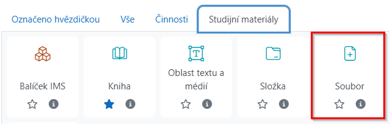
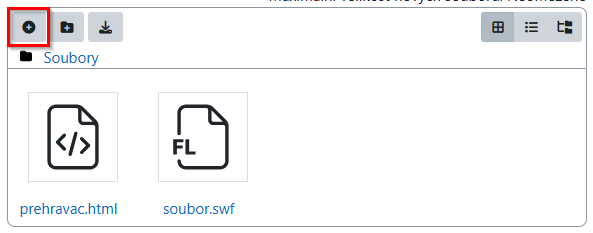
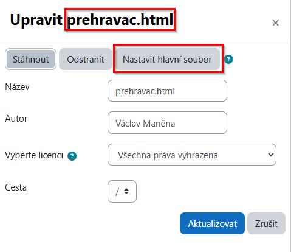
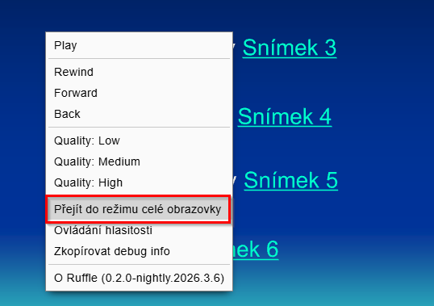

# Jak vložit soubory swf do Moodlu
Tento postup vám umožní vložit do Moodlu soubory ve formátu swf tak, že si uživatelé budou moci prohlížet jejich obsah bez instalování přehrávače nebo rozšíření prohlížeče. **V Moodlu ani na straně uživatele není potřeba nic instalovat.**

Postup využívá zdarma dostupný emulátor [ruffle](https://ruffle.rs/), který vložený flashový soubor ve formátu swf převede na HTML5. Uživateli se stránka zobrazí stejně jako běžný obsah.

## Postup vložení souboru
 Tento návod předpokládá, že soubor s Flashem má název **soubor.swf**. Pokud chcete použít jiný název, upravte ho v souboru **prehravac.html**.
 
    

      <embed src="soubor.swf" style="width:100%; height:100%;">
    

 
### Krok 1 – Přidání studijního materiálu Soubor
Přidejte do kurzu studijní materiál **Soubor**.
 
 

### Krok 2 – Nahrání swf a přehrávače
Nahrajte soubor swf a [prehravac.html](https://github.com/vmanena/public/releases/download/v1.0/prehravac.html).

### Krok 3 - Nastavení přehrávače jako hlavního souboru
Klikněte na **prehravac.html** a v dialogu ho nastavte jako hlavní. Studijní materiál uložte.

### Krok 4 – Vyzkoušení a případné úpravy
Vyzkoušejte, jestli se soubor zobrazuje správně. Většina materiálů ve formátu swf by se měla správně zobrazovat s hodnotami, které jsou nastaveny v přehrávači. Pokud by byl materiál zdeformovaný, můžete zkusit změnit poměr stran. Kromě 5/4 používaly materiály většinou poměr 4/3. Pokud je materiál moc velký, upravte procenta. **Poměr i procenta měňte pouze v následujícím řádku:**

    

 
Upravený soubor znovu nahrajde do Moodlu a vyzkoušejte, jak se materiál zobrazuje. Nejjednoduší je soubor nahrát znovu a při nahrávání zvolit možnost **Přepsat**.

## Poznámka pro uživatele
Materiály je možné zobrazit i v režimu celé obrazovky. Stačí na zobrazený materiál kliknout **pravým tlačítkem myši** a v kontextové nabídce vybrat **Přejít do režimu celé obrazovky**.

